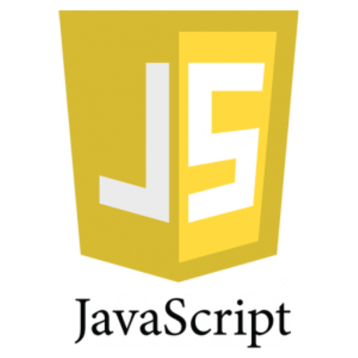
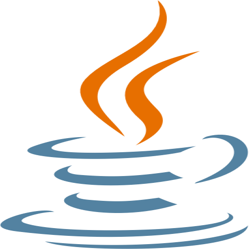
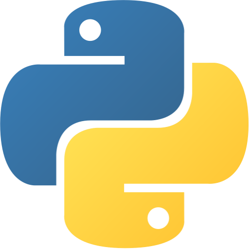
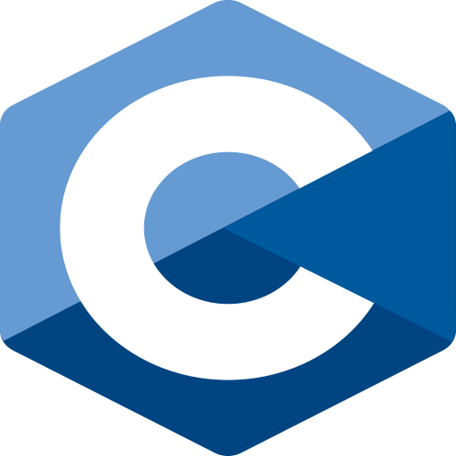
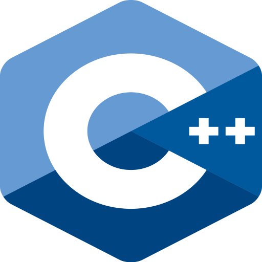
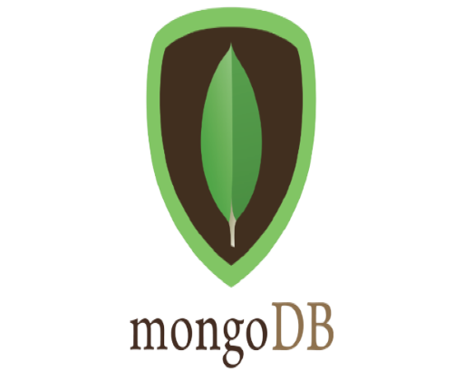

### Hi there!👋 My name is Jose Antonio and I'm a Computer Science student.
- 🔭 I’m currently working on my university degree
- 🌱 I’m currently learning about cybersecurity and web development
- 👯 I’m looking to collaborate on new projects 
- 📫 How to reach me:  
- 😄 Pronouns: He/Him
 

### Languages and Tools

 
 
 
 

### Status

